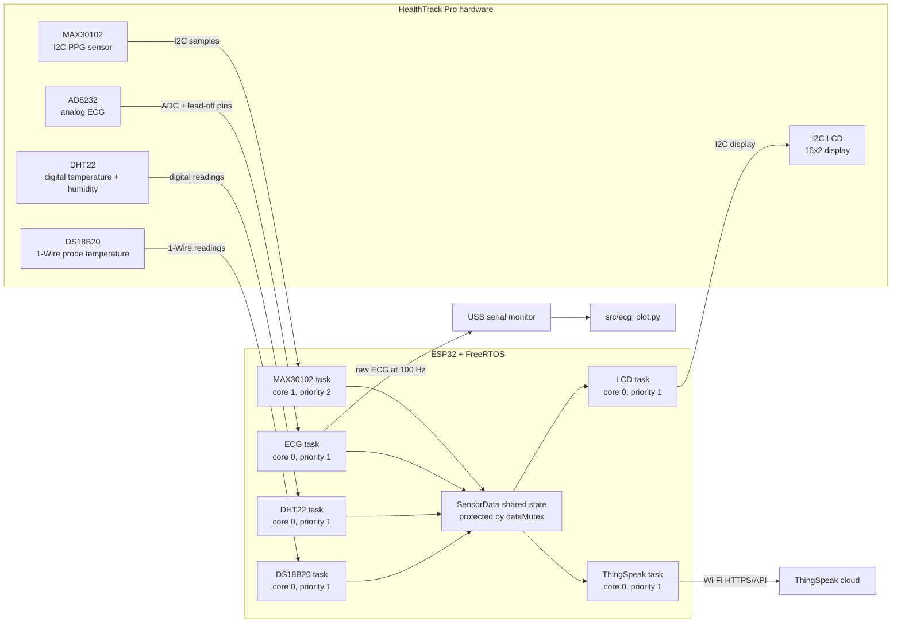

# HealthTrack Pro

**A real-time patient monitoring system powered by ESP32 and FreeRTOS.**

## Features
- Monitors ECG, heart rate, SpO2, ambient temperature and humidity, and probe temperature using MAX30102, AD8232, DHT22, and DS18B20 sensors.
- Real-time multitasking using FreeRTOS with task prioritization and dual-core task pinning.
- Data visualization and cloud logging via ThingSpeak.
- Python-based ECG waveform plotting for sensor validation.

## Hardware Used
- ESP32 Dev Board
- MAX30102 (Pulse Oximeter & Heart Rate)
- AD8232 (ECG Sensor)
- DHT22 (Temperature & Humidity)
- DS18B20 (Digital Temperature Sensor)
- 4.7k ohm resistor for the DS18B20 data-line pull-up
- Jumper Wires, Breadboard

## ESP32 Wiring Used by the Firmware

| Component | Signal | ESP32 pin / setting |
|---|---|---|
| MAX30102 | SDA / SCL | GPIO 21 / GPIO 22 |
| I2C LCD | SDA / SCL | GPIO 21 / GPIO 22, address `0x27` (`0x3F` if required) |
| DHT22 | DATA | GPIO 4 |
| DS18B20 | DATA | GPIO 5 with a 4.7k ohm pull-up to 3.3V |
| AD8232 | OUTPUT | GPIO 34 |
| AD8232 | LO+ / LO- | GPIO 32 / GPIO 33 |

The MAX30102 and LCD share the I2C bus; the firmware protects that bus with a mutex.

## Software Stack
- PlatformIO (VS Code)
- C++ with FreeRTOS
- Python (for data validation)
- ThingSpeak (Cloud logging)
- Git & GitHub

## Architecture
- FreeRTOS tasks handle each sensor independently using core pinning and mutex-protected shared data.
- Sensor data is collected, processed, and published to the cloud.
- Real-time graphs plotted using Python for debugging ECG signals.

## Setup
1. Clone the repository:
```sh
git clone https://github.com/shrishail2728/HealthTrack-Pro.git
cd HealthTrack-Pro
```

2. Open with VS Code + PlatformIO extension.
3. Copy `include/secrets.example.h` to `include/secrets.h` and enter your Wi-Fi and ThingSpeak values. `include/secrets.h` is ignored and must not be committed.
4. Connect the ESP32 board.
5. Upload the code via PlatformIO.
6. Open the serial monitor at 115200 baud.
7. (Optional) Set `PORT` in `src/ecg_plot.py` and run it to plot ECG samples.

## Folder Structure
- `/src`: Main firmware code
- `/include`: Header files
- `/src/ecg_plot.py`: Python ECG plotting utility
- `platformio.ini`: Project Configuration file which includes library

## ThingSpeak Fields

| Field | Value |
|---|---|
| 1 | MAX30102 heart rate (BPM) |
| 2 | MAX30102 SpO2 (%) |
| 3 | AD8232 ECG ADC value |
| 4 | DHT22 ambient temperature (C) |
| 5 | DHT22 humidity (%) |
| 6 | DS18B20 probe temperature (C) |

## Cloud Integration
- Uses ThingSpeak REST API for posting real-time sensor data.
- Visual dashboards created on ThingSpeak channels.

## Complete System Architecture

HealthTrack Pro is an ESP32-only patient-health monitoring system. The ESP32 runs the Arduino framework on top of FreeRTOS. Each sensor and output has an independent task, while a shared `SensorData` object provides the latest readings to the LCD, serial output, and ThingSpeak.

### End-to-End Data Flow



### Runtime Layers

1. **Hardware layer**: MAX30102, AD8232, DHT22, DS18B20, and the I2C LCD are connected to the ESP32 using the pin assignments documented above.
2. **Driver layer**: PlatformIO libraries provide I2C, Wi-Fi, MAX30102 access, DHT22 access, 1-Wire/DS18B20 access, LCD control, and ThingSpeak communication.
3. **Processing layer**: FreeRTOS tasks sample sensors, validate readings, calculate heart rate/SpO2, and update the shared state.
4. **Presentation layer**: The LCD cycles through measurements, the serial port prints diagnostics and ECG samples, and the Python utility plots ECG data.
5. **Cloud layer**: The ThingSpeak task periodically sends valid measurements over Wi-Fi.

### ESP32 Task Architecture

| Task | Core | Priority | Stack | Rate | Responsibility |
|---|---:|---:|---:|---:|---|
| `MAX30102 Task` | 1 | 2 | 4096 | 10 ms | Reads IR/red PPG data, fills 100-sample buffers, and runs Maxim heart-rate and SpO2 algorithms. |
| `DHT22 Task` | 0 | 1 | 2048 | 2 s | Reads ambient temperature and humidity. |
| `DS18B20 Task` | 0 | 1 | 2048 | 2 s | Requests a 10-bit probe-temperature conversion and validates the result. |
| `ECG Task` | 0 | 1 | 2048 | 10 ms | Reads GPIO34, checks AD8232 lead-off pins, detects threshold crossings, and prints raw ECG samples. |
| `LCD Task` | 0 | 1 | 2048 | 2 s | Takes a safe snapshot and rotates through BPM, SpO2, ambient temperature, humidity, ECG, and probe temperature pages. |
| `ThingSpeak Task` | 0 | 1 | 4096 | 20 s | Takes a safe snapshot, reconnects Wi-Fi when needed, and publishes valid fields to ThingSpeak. |

The Arduino `loop()` does not process application data. It is suspended indefinitely because all application work is performed by the FreeRTOS tasks.

### Startup Sequence

1. Start the serial port at `115200` baud and initialize the ESP32 I2C bus on GPIO21/GPIO22.
2. Create `dataMutex`, `i2cMutex`, and `bufferMutex`. The firmware stops safely if any synchronization object cannot be created.
3. Initialize the 16x2 LCD and show the initialization message.
4. Initialize MAX30102, DHT22, DS18B20, and AD8232. MAX30102 and DS18B20 availability are recorded so a missing device does not stop the other tasks.
5. Attempt Wi-Fi connection for up to 20 seconds. If it fails, the system continues in offline mode and keeps sensor tasks running.
6. Initialize the ThingSpeak client.
7. Start all six application tasks on their assigned ESP32 cores.

### Shared Data and Synchronization

The latest readings are stored in the `SensorData` structure:

| Value | Type | Meaning |
|---|---|---|
| `bpm` | `float` | MAX30102 heart rate result. |
| `spo2` | `int32_t` | MAX30102 SpO2 result. |
| `ecgValue` | `int32_t` | Latest AD8232 ADC value. |
| `ecgBpm` | `float` | Threshold-based ECG beat interval estimate. |
| `temperature` | `float` | DHT22 ambient temperature. |
| `humidity` | `float` | DHT22 relative humidity. |
| `probeTemperature` | `float` | DS18B20 probe temperature. |
| validity flags | `bool` | Indicate whether MAX30102 and DS18B20 values are valid. |

The synchronization design is:

- `dataMutex` protects the shared `SensorData` structure. Writers update one sensor result at a time, while LCD and ThingSpeak first copy a complete snapshot and then release the mutex.
- `bufferMutex` protects the MAX30102 IR/red sample arrays and their index while the 100-sample Maxim algorithm window is filled and processed.
- `i2cMutex` protects the shared I2C bus so MAX30102 and LCD transactions cannot interfere with each other.
- The firmware uses a latest-value model rather than a queue. Consumers always receive the newest complete snapshot available.

### Sensor Processing Details

#### MAX30102

The MAX30102 task samples IR and red channels at approximately 100 Hz. When no finger is detected (`IR < 5000`), heart rate and SpO2 are marked invalid and the sample buffer is reset. With a finger detected, 100 samples are collected before Maxim's heart-rate and oxygen-saturation algorithms are executed. Invalid algorithm results are not presented as real measurements.

#### AD8232 ECG

The ECG task samples the analog output on GPIO34 every 10 ms. GPIO32 and GPIO33 are checked for the AD8232 lead-off signals. When either lead is disconnected, the ECG value and ECG BPM are reset to zero. Otherwise, the raw ADC value is stored and printed continuously for the Python plotter. A rising crossing above the configurable `ecgThreshold` of 512 is used for the simple ECG beat-interval estimate, with a 300 ms minimum beat interval to reject rapid false triggers.

#### DHT22

The DHT22 task reads ambient temperature and humidity every two seconds. The DHT library's invalid readings are stored as `NAN`; LCD and ThingSpeak output skip invalid values.

#### DS18B20

The DS18B20 task uses the 1-Wire bus on GPIO5 and a 4.7k ohm pull-up to 3.3V. It requests a blocking 10-bit conversion every two seconds and accepts only values in the DS18B20 operating range of -55 C to 125 C. Missing, disconnected, or invalid readings are represented as `NAN` and shown as `Probe: N/A`.

### Output Paths

| Output | Source | Behavior |
|---|---|---|
| 16x2 I2C LCD | `LCD Task` | Rotates through six screens every two seconds and displays `N/A` when a value is invalid. |
| USB serial monitor | All tasks | Prints initialization, Wi-Fi, sensor errors, cloud status, temperature diagnostics, and raw ECG samples at 115200 baud. |
| Python ECG plot | `src/ecg_plot.py` | Reads the serial ECG stream and plots the waveform when a serial port is configured. |
| ThingSpeak | `ThingSpeak Task` | Publishes fields 1-6 every 20 seconds when Wi-Fi is connected. Invalid optional values are skipped. |

### Cloud Data Mapping

The ThingSpeak task sends the shared-state snapshot using this mapping:

```text
SensorData.bpm                 -> ThingSpeak field 1
SensorData.spo2                -> ThingSpeak field 2
SensorData.ecgValue            -> ThingSpeak field 3
SensorData.temperature         -> ThingSpeak field 4
SensorData.humidity            -> ThingSpeak field 5
SensorData.probeTemperature    -> ThingSpeak field 6
```

Heart rate, SpO2, DHT22 values, and DS18B20 values are sent only when valid. ECG ADC data is sent whenever the task has a Wi-Fi connection, including zero when AD8232 leads are off.

### Fault Handling and Recovery

- **MAX30102 missing**: The MAX30102 task remains alive but waits and reports unavailable status; other sensor tasks continue.
- **DS18B20 missing**: The probe value becomes invalid and the LCD/cloud paths avoid publishing it; other sensors continue.
- **No finger on MAX30102**: PPG buffers are cleared and BPM/SpO2 validity is reset.
- **DHT22 invalid sample**: `NAN` is stored and omitted from LCD/cloud output.
- **AD8232 leads off**: ECG value and ECG BPM are reset to zero until both leads are connected.
- **Wi-Fi unavailable**: Sensor processing continues offline; the ThingSpeak task retries the connection before its next update.
- **ThingSpeak failure**: The response code is printed to serial and the task retries on its next 20-second cycle.
- **I2C contention**: MAX30102 and LCD access is serialized with `i2cMutex`.
- **Synchronization allocation failure**: The firmware reports the failure and stops rather than operating with unprotected shared data.

### Practical Execution Sequence

```text
Power on ESP32
    -> Initialize buses, mutexes, LCD, and sensors
    -> Try Wi-Fi connection
    -> Start FreeRTOS tasks
    -> Read sensors at their own rates
    -> Validate and store the latest readings
    -> Display values on LCD and print diagnostics/ECG to serial
    -> Publish valid cloud fields every 20 seconds
    -> Repeat until power is removed
```
